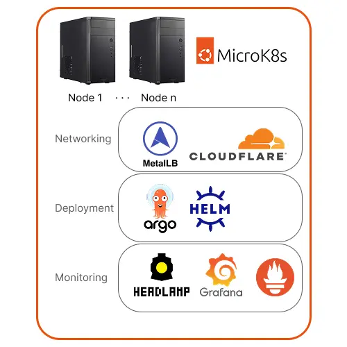

# Kubebernetes Homelab Foundation 

This is a working repo for my homelab Kubernetes setup. It covers the foundational tools that I use in my homelab.  

## Networking
[Networking Walkthrough](./networking/readme.md)

### Metallb
[Metallb Docs](https://metallb.io/)  

Metallb can assign IPs to Kuberenetes gateways. This makes it easy to expose services on your local network and then add those IPs to your local DNS. 

### Cloudflare Tunnels
[Cloudflare Tunnels Docs](https://developers.cloudflare.com/tunnel/)  

Cloudflare tunnels run alongside applications and expose applications through the tunnel to the public internet. This helps reduce a server's exposure to the public internet when hosting applications. 

## Deployment
[Deployment Walkthrough](./deployment/readme.md)

### ArgoCD
[ArgoCD Docs](https://argo-cd.readthedocs.io/en/stable/)

ArgoCD is a continuous delivery tool that uses Git repos as the source of truth for defining a desired application state. ArgoCD also provides single pane to manage applications.   
Helm charts can be used as the source of truth for ArgoCD, which makes it easy manage both third party and custom applications.  

## Monitoring
[Monitoring Walkthrough](./monitoring/readme.md)

### Headlamp
[Headlamp Docs](https://argo-cd.readthedocs.io/en/stable/)  

Headlamp provieds high level cluster monitoring. It is pretty straightforward to setup, and can be ran as a desktop app that uses your kubectl config to connect to multiple clusters.  

### Prometheus
[Prometheus K8s Stack](https://github.com/prometheus-community/helm-charts/tree/main/charts/kube-prometheus-stack)  

Prometheus is a metric aggregator. It can be deployed with the `kube-prometheus-stack` helm chart, which automatically starts tracking all sorts of metrics from the kube-system namespace. This can be used to gather metrics from other services that I may setup in the future as well.  

### Grafana
[Grafana Docs](https://grafana.com/docs/grafana/latest/fundamentals/getting-started/first-dashboards/)   

The kube-prometheus-stack also installs Grafana for the metric dashboard. It comes with a bunch of pre-configured dashboards, and connects to Prometheus for metrics. This also will allow for creating monitoring dashboards for other applications. 

## Storage
[Storage Walkthrough](./storage/readme.md)

### NFS
[NFS setup Docs](https://canonical.com/microk8s/docs/how-to-nfs)  

NFS allows you to share files and directories between Linux systems over a network. This allows us to use PVCs where the storage is on another node. 

## GPU Setup
[GPU Setup Walkthrough](./gpu/readme.md)

### NVIDIA GPUs
[Nvidia GPU Setup Docs](https://docs.nvidia.com/datacenter/cloud-native/openshift/latest/install-gpu-ocp.html)  
[GPU Time Slicing Docs](https://docs.nvidia.com/datacenter/cloud-native/gpu-operator/latest/gpu-sharing.html#understanding-time-slicing-gpus)  

The Nvidia gpu operator will allow us to run GPU workloads from Kubernetes  

